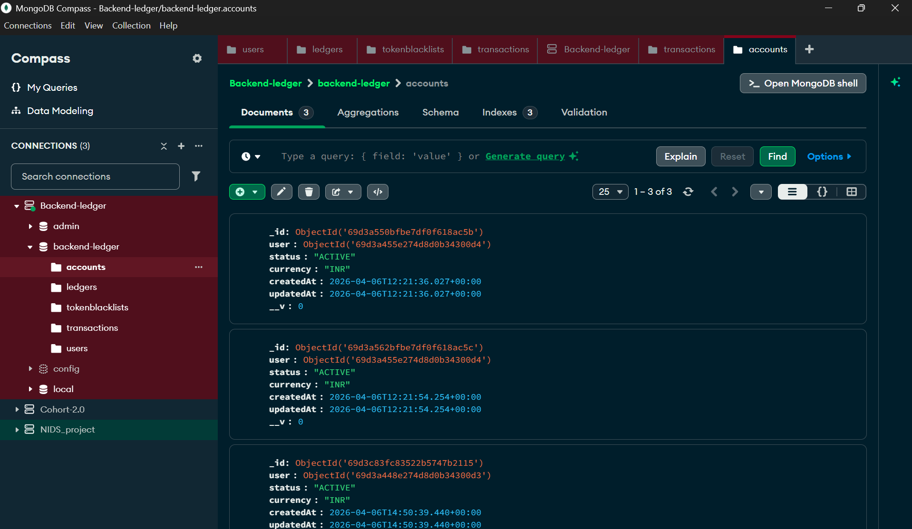
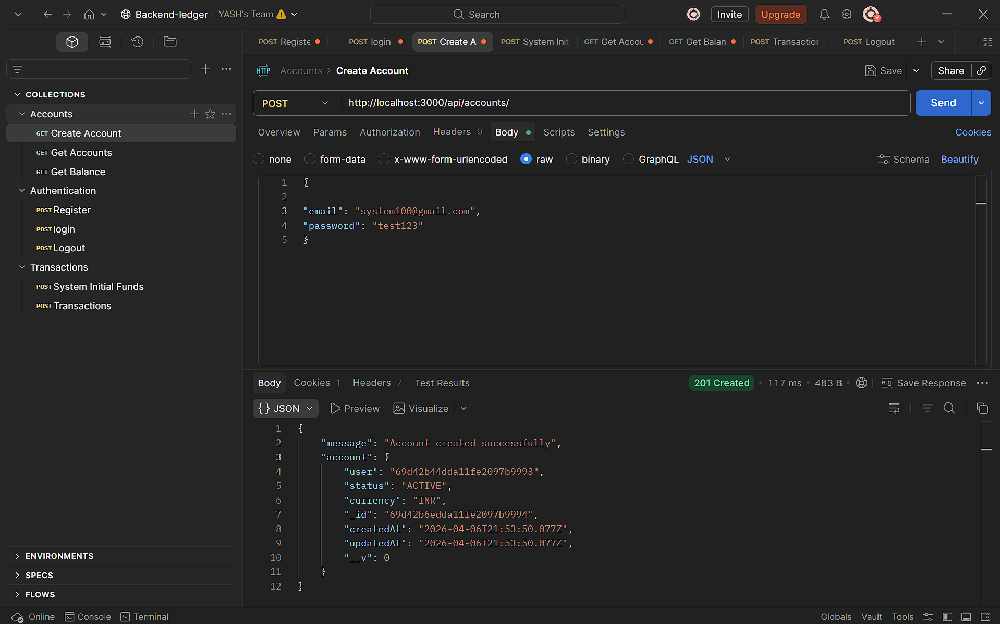
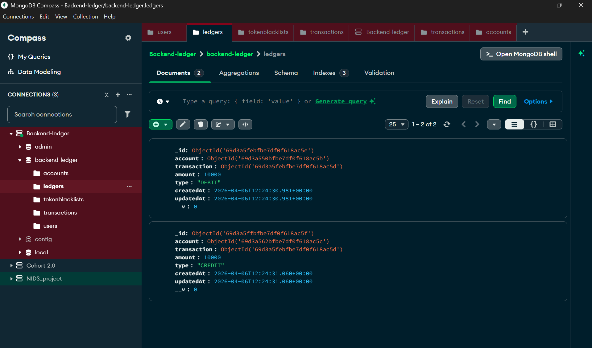

## Screenshots

### MongoDB Collections

### Transaction API (Postman)

### Ledger Entries

# Backend Ledger System

A backend system that simulates how real-world financial transactions work using accounts, ledgers, and transactions. This project focuses on clean backend architecture, data consistency, and real-world concepts like idempotency and balance calculation.

---

## Overview

This project is built to understand and implement how money flows between accounts in a system. Instead of directly updating balances, all transactions are recorded in a ledger and the balance is calculated from it. This approach is used in real financial systems.

The system supports creating accounts, transferring funds, tracking transactions, and calculating balances using MongoDB aggregation.

---

## Features

- Create and manage user accounts
- Perform transactions between accounts
- Ledger-based accounting system
- Balance calculation using aggregation
- Idempotency support to prevent duplicate transactions
- System user support for initial fund transfers
- JWT-based authentication and authorization
- Error handling for edge cases like insufficient balance

---

# Backend Ledger System

A backend system that simulates how real-world financial transactions work using accounts, ledgers, and transactions. This project focuses on clean backend architecture, data consistency, and real-world concepts like idempotency and balance calculation.

---

## Overview

This project is built to understand and implement how money flows between accounts in a system. Instead of directly updating balances, all transactions are recorded in a ledger and the balance is calculated from it. This approach is used in real financial systems.

The system supports creating accounts, transferring funds, tracking transactions, and calculating balances using MongoDB aggregation.

---

## Features

- Create and manage user accounts
- Perform transactions between accounts
- Ledger-based accounting system
- Balance calculation using aggregation
- Idempotency support to prevent duplicate transactions
- System user support for initial fund transfers
- JWT-based authentication and authorization
- Error handling for edge cases like insufficient balance

---

## Tech Stack

- Node.js
- Express.js
- MongoDB with Mongoose
- JWT Authentication

---

## Project Structure
src/
│
├── controllers/
├── models/
├── routes/
├── middleware/
├── services/

---

## How It Works

Instead of storing balance directly in the account:

- Every transaction creates two ledger entries
  - Debit from sender
  - Credit to receiver

- Balance is calculated using aggregation:
  - Total Credits minus Total Debits

This ensures accuracy and prevents inconsistencies.

---

## API Endpoints

### Auth

- Register user
- Login user

### Accounts

- Create account
- Get all accounts
- Get account balance

### Transactions

- Transfer funds between accounts
- Add initial funds (system user only)

---

## Idempotency

Each transaction requires an `idempotencyKey`.

This ensures:
- Duplicate requests do not create duplicate transactions
- Safe retry mechanism

---

## Environment Variables

Create a `.env` file and add:
PORT=3000
MONGO_URI=your_mongodb_connection_string
JWT_SECRET=your_secret_key

---

## Installation

Clone the repository:
git clone https://github.com/Yash-Bagul07/backend-ledger.git
cd backend-ledger

Install dependencies :
npm install

Run the Server:
npm run dev

---

## Deployment

This project can be deployed on platforms like Render.

Important points:
- Use MongoDB Atlas (cloud database)
- Add environment variables in Render dashboard
- Do not use localhost MongoDB

---

## Key Learning Points

- Ledger-based accounting system
- MongoDB aggregation pipelines
- Transaction handling with consistency
- Middleware-based authentication
- Idempotency in APIs

---

## Future Improvements

- Transaction history with filters
- Pagination support
- Email notifications
- Rate limiting
- Admin dashboard

---

## Author

Built by a developer focused on learning backend systems and real-world architecture.
